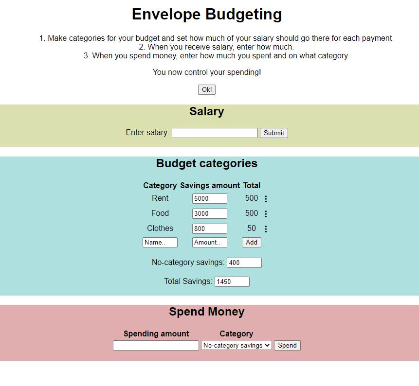
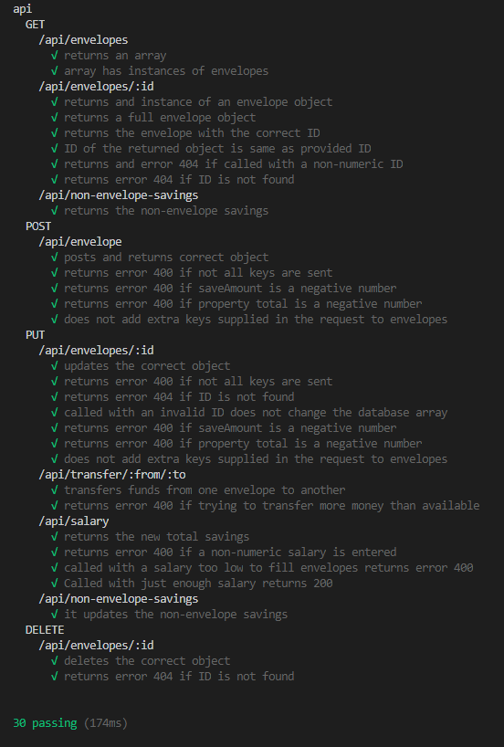

# Envelope Budgeting! 
A simple web application to control your spending. 
## Introduction - the projects aim
This is the first web application where I built the entire front-end and back-end of a web application. The main goal was to develop a functioning back-end server, but I have also added a front-end (*it might not be as professional, but it makes the application more fun to use*). The main back-end developing techniques I wanted to practice in this project were: 
- Routing from a server to a website
- Database functionality 
- Automated testing of functionality
- Error handling 

The project is a challange-project from the Back-End Developer course at Codecademy. It is a project where not much guidance is given, to cement the knowledge from the course hands-on. 

## Launch
To get started, you first need to have installed Node.js and NPM, and also have a console compatible with both of these softwares (like git Bash). Then follow the steps bellow:
1. Download the files and extract them in a folder.
2. Navigate to the folder with your console, and enter: *npm -install*. This will installed all required packages that the application uses.
3. In the console, enter: *node .\server\app.js*  to start the server. 
4. Go into your browser and enter: *http://localhost:4000/*

The application should now be visible in your browser!

## How to use the application
The application is used in the browser! 
1. Make categories for your budget and set how much of your salary should go there for each payment.
2. When you receive salary, enter how much.
3. When you spend money, enter how much you spent and on what category.

You now control your spending!

## Automated functionality testing
This application has built in automated testing for most of the applications serverside functionality. If you want to run the testing, enter the command: *npm -test* in the console.

## Technologies:
- Javascript ES6
- Node.js v14.15.3
- NPM v14.15.3
- HTML5
- CSS3
- Express v4.17.1
- Supertest v6.11.3
- Mocha v8.3.2
- Chai v4.3.4
- Cors v2.8.5

## Illustration
### Website preview

## Testing preview
